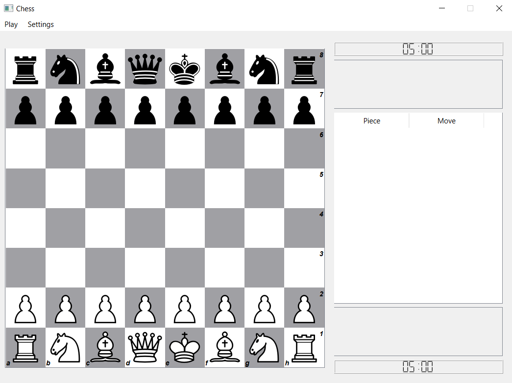
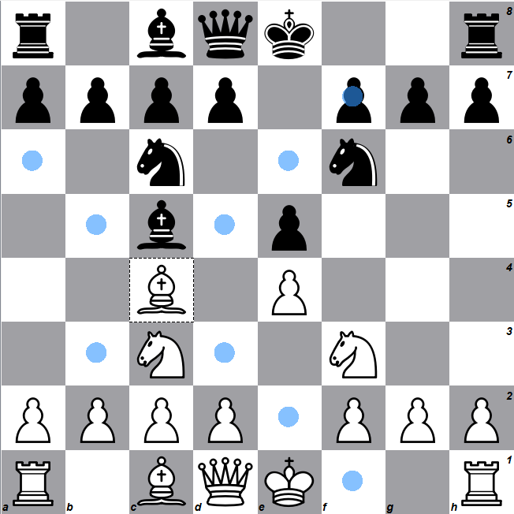
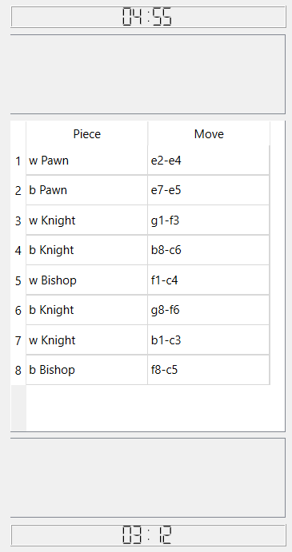
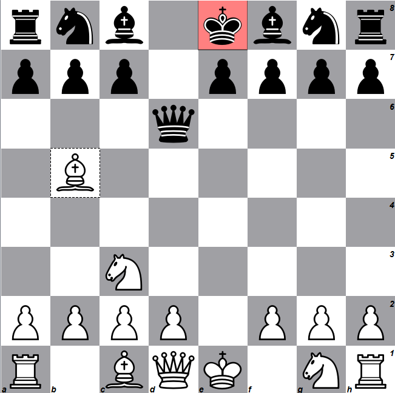
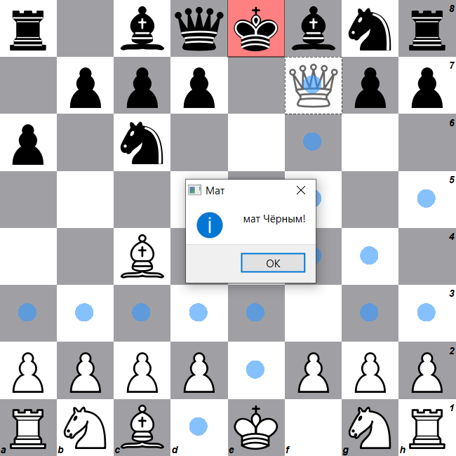
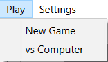
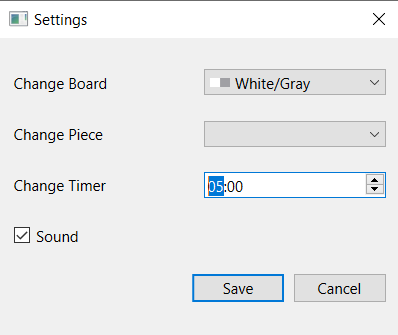

# ♟️ Chess Game in Qt (C++)

A fully functional chess game with a clean interface built using **C++** and **Qt 6**, featuring **Stockfish** engine integration.

## 🚀 Features

- Full chess rules with all piece movements
- Drag & Drop piece movement
- Captured pieces displayed in a separate area
- Pawn promotion with a selection dialog
- Move hints (highlighted available moves)
- Check highlight (yellow/red square on the king)
- Checkmate and stalemate detection
- Castling
- Sound effects (move, capture, check, promotion)
- Play against **Stockfish** chess engine

## 🖥️ Technologies

- **C++17**
- **Qt 6** (QGraphicsView, QGraphicsScene, QSoundEffect, QProcess)
- **Stockfish Chess Engine**

## 📦 Installation & Run

1. Clone the repository:
   ```bash
   git clone https://github.com/VaheZilabyan/Chess-Qt.git

2. Open the project in **Qt Creator**.

3. Download [Stockfish](https://stockfishchess.org/download/) and place the executable somewhere on your computer.

4. Set the path to **Stockfish** in your code (e.g., in startEngine()):

startEngine("C:/path/to/stockfish.exe");

Build and run the project from Qt Creator.

##  📷 Screenshot
### MainWindow:

### Moves/legalMoves:

### History:

### Highlight:

### Mate:

### Play:

### Settings:

### Colors:
                

## 📜 License
This project is for educational purposes. Feel free to modify and improve it.
